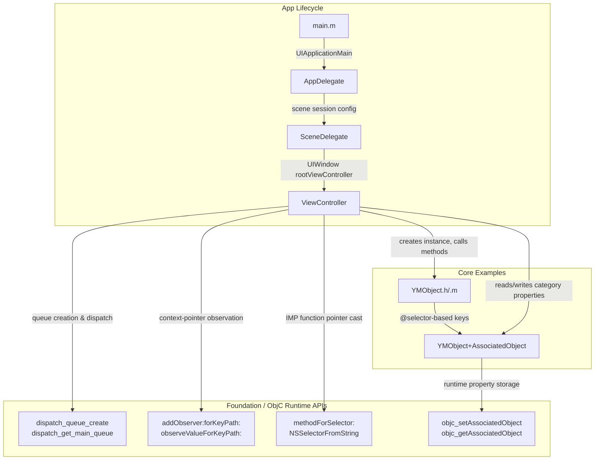

<h1 align="center">OCCodeBook</h1>

<p align="center"><strong>An Objective-C code reference book in the form of a runnable iOS project</strong></p>

<p align="center">
  <a href="https://github.com/yuman07/OCCodeBook/stargazers"></a>
  <br>
  <a href="https://developer.apple.com/documentation/objectivec"></a>
  <a href="https://developer.apple.com/ios/"></a>
  <a href="LICENSE"></a>
</p>

<p align="center"><a href="README.md">English</a> | <a href="README_ZH.md">中文</a></p>

---

## What is OCCodeBook?

OCCodeBook is a practical Objective-C code handbook built as a working iOS project. Instead of static documentation, it provides runnable code examples that demonstrate commonly used Objective-C programming patterns and advanced features — from memory management macros to runtime programming.

Open it in Xcode, browse the source files, and see each pattern in real, compilable context.

## Features

- **Weak-Strong Macros** — `TSWeakify` / `TSStrongify` for safe block capture, plus `RUN_BLOCK` for nil-safe block invocation
- **Enum & Constant Patterns** — Standard `NS_ENUM` / `NS_OPTIONS` definitions, `FOUNDATION_EXPORT` public constants vs `static const` private constants
- **Singleton Pattern** — Thread-safe implementation using `dispatch_once`
- **Block Handling** — Type aliases, blocks as method parameters, and block properties with proper memory management
- **Class Properties** — `@property (class, ...)` backed by static variables
- **Associated Objects** — Dynamically adding properties to categories via `objc_setAssociatedObject` / `objc_getAssociatedObject`, covering object, primitive, and block types
- **KVO (Key-Value Observing)** — Context-pointer-based observer dispatch, scalar and mutable array observation, proper cleanup in `dealloc`
- **GCD (Grand Central Dispatch)** — Creating serial / concurrent queues, accessing main / global queues
- **String & Emoji Handling** — Safe iteration and truncation of strings containing complex emoji (flags, skin tone modifiers, ZWJ sequences)
- **Runtime Programming** — Calling private methods via `NSSelectorFromString` + `methodForSelector:` + function pointer casting

## Development

> **macOS only** — Xcode is required and only runs on macOS.

### Prerequisites

| Requirement | Minimum Version  |
|-------------|------------------|
| macOS       | 15.6 (Sequoia)   |
| Xcode       | 26.0             |

### Build Steps

```bash
# 1. Clone the repository
git clone https://github.com/yuman07/OCCodeBook.git

# 2. Navigate to the project directory
cd OCCodeBook

# 3. Open the Xcode project
open OCCodeBook.xcodeproj

# 4. In Xcode, select a simulator or device, then press ⌘B to build or ⌘R to run
```

No third-party dependencies — the project uses only Foundation and UIKit.

## Technical Overview

OCCodeBook is a minimal iOS app whose sole purpose is to serve as a browsable code reference. The project deliberately avoids third-party dependencies so that every example demonstrates pure Objective-C / Foundation / UIKit patterns without external noise.

The code is organized into two layers:

- **Model layer** (`Sources/`) — `YMObject` serves as the central demonstration class. Its header defines macros, enums, constants, block type aliases, and the singleton / class-property / block-property interfaces. The implementation provides the concrete patterns. A separate category (`YMObject+AssociatedObject`) demonstrates runtime-based property injection using `objc_setAssociatedObject` with three distinct association types (object, primitive, block).
- **Controller layer** (`ViewController`) — Demonstrates patterns that require a live UIKit context: GCD queue creation, KVO observation with context-pointer dispatch, emoji-safe string operations, and runtime private method invocation via IMP function-pointer casting.

### Tech Stack

| Category   | Technology              |
|------------|-------------------------|
| Language   | Objective-C, C (gnu11)  |
| Frameworks | Foundation, UIKit       |
| Runtime    | Objective-C Runtime     |
| Build Tool | Xcode 26                |
| Target     | iOS 26.0+               |

### Architecture



- **App lifecycle flow** — `main.m` calls `UIApplicationMain`, which creates `AppDelegate`. The app delegate configures scene sessions, and `SceneDelegate` sets `ViewController` as the window's root view controller. This is standard UIKit boilerplate.
- **ViewController as demo driver** — `ViewController` instantiates `YMObject` and contains methods (`useQueue`, `setupKVO`, `stringEmoji`, `callPrivateMethod`) that each demonstrate a distinct Objective-C pattern. It directly exercises Foundation APIs (GCD, KVO) and Objective-C runtime APIs (IMP casting).
- **YMObject as pattern catalog** — The header/implementation pair covers macros, enums, constants, singleton, blocks, and class properties. The private method `doSomeThingWithName:age:birthday:` exists specifically to be invoked via runtime from `ViewController`.
- **Category for runtime injection** — `YMObject+AssociatedObject` adds three properties (`NSString`, `NSInteger`, block) to demonstrate all common `objc_setAssociatedObject` usage patterns without modifying the original class.

### Project Structure

```
OCCodeBook/
|-- OCCodeBook.xcodeproj/                    # Xcode project configuration
|-- OCCodeBook/
|   |-- Sources/
|   |   |-- YMObject.h                       # Macros, enums, constants, singleton, blocks, class properties
|   |   |-- YMObject.m                       # Implementations + private method for runtime demo
|   |   |-- YMObject+AssociatedObject.h      # Category interface: object, primitive, block properties
|   |   `-- YMObject+AssociatedObject.m      # Associated object implementations via objc runtime
|   |-- ViewController.h                     # View controller interface
|   |-- ViewController.m                     # GCD, KVO, emoji handling, runtime method calling
|   `-- Support/
|       |-- AppDelegate.h/.m                 # App lifecycle management
|       |-- SceneDelegate.h/.m               # Scene session management
|       |-- main.m                           # Entry point
|       |-- Assets.xcassets/                 # Asset catalog (app icon, accent color)
|       |-- Info.plist                       # App configuration
|       `-- Base.lproj/
|           |-- Main.storyboard              # Main UI layout
|           `-- LaunchScreen.storyboard      # Launch screen
|-- README.md                                # English documentation
|-- README_ZH.md                             # Chinese documentation
|-- LICENSE                                  # MIT License
`-- .gitignore
```

## Acknowledgments

- [Calling Private Methods in Objective-C](https://github.com/dabing1022/Blog/issues/2) — Reference for the runtime method invocation pattern

## License

This project is licensed under the [MIT License](LICENSE).
