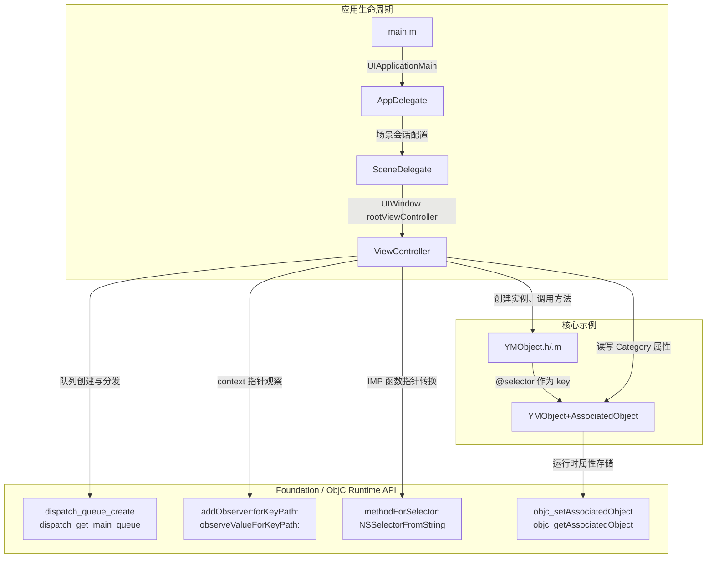

<h1 align="center">OCCodeBook</h1>

<p align="center"><strong>以可运行 iOS 工程形式呈现的 Objective-C 代码手册</strong></p>

<p align="center">
  <a href="https://github.com/yuman07/OCCodeBook/stargazers"></a>
  <br>
  <a href="https://developer.apple.com/documentation/objectivec"></a>
  <a href="https://developer.apple.com/ios/"></a>
  <a href="LICENSE"></a>
</p>

<p align="center"><a href="README.md">English</a> | <a href="README_ZH.md">中文</a></p>

---

## OCCodeBook 是什么？

OCCodeBook 是一本实用的 Objective-C 代码手册，以可运行的 iOS 工程形式呈现。它不是静态文档，而是提供可编译运行的代码示例，涵盖常用的 Objective-C 编程模式和高级特性——从内存管理宏到运行时编程。

用 Xcode 打开工程，浏览源文件，即可在真实、可编译的上下文中查看每种模式。

## 特性

- **Weak-Strong 宏** — `TSWeakify` / `TSStrongify` 安全捕获 Block 引用，`RUN_BLOCK` 安全调用可能为 nil 的 Block
- **枚举与常量模式** — 标准 `NS_ENUM` / `NS_OPTIONS` 定义，`FOUNDATION_EXPORT` 公开常量 vs `static const` 私有常量
- **单例模式** — 基于 `dispatch_once` 的线程安全实现
- **Block 处理** — 类型别名、Block 作为方法参数、Block 属性及正确的内存管理
- **类属性** — `@property (class, ...)` 配合静态变量实现类级别属性
- **关联对象** — 通过 `objc_setAssociatedObject` / `objc_getAssociatedObject` 为 Category 动态添加属性，涵盖对象类型、基本类型和 Block 类型
- **KVO（键值观察）** — 基于 context 指针的观察者分发，标量属性与可变数组的观察，`dealloc` 中正确移除观察者
- **GCD（多线程）** — 创建串行 / 并发队列，获取主队列 / 全局队列
- **字符串与 Emoji 处理** — 安全遍历和截断包含复杂 Emoji（国旗、肤色修饰符、ZWJ 序列）的字符串
- **运行时编程** — 通过 `NSSelectorFromString` + `methodForSelector:` + 函数指针转换调用私有方法

## 开发

> **仅限 macOS** — Xcode 仅在 macOS 上运行。

### 前置要求

| 要求   | 最低版本          |
|--------|-------------------|
| macOS  | 15.6 (Sequoia)    |
| Xcode  | 26.0              |

### 构建步骤

```bash
# 1. 克隆仓库
git clone https://github.com/yuman07/OCCodeBook.git

# 2. 进入项目目录
cd OCCodeBook

# 3. 打开 Xcode 工程
open OCCodeBook.xcodeproj

# 4. 在 Xcode 中选择模拟器或设备，按 ⌘B 编译或 ⌘R 运行
```

无第三方依赖——项目仅使用 Foundation 和 UIKit。

## 技术概览

OCCodeBook 是一个极简 iOS 应用，唯一目的是作为可浏览的代码参考。项目刻意不引入第三方依赖，确保每个示例都展示纯粹的 Objective-C / Foundation / UIKit 模式，不受外部干扰。

代码分为两层：

- **模型层**（`Sources/`）— `YMObject` 是核心演示类，头文件定义了宏、枚举、常量、Block 类型别名以及单例 / 类属性 / Block 属性接口，实现文件提供具体模式。独立的 Category（`YMObject+AssociatedObject`）演示基于运行时的属性注入，使用 `objc_setAssociatedObject` 覆盖三种不同的关联类型（对象、基本类型、Block）。
- **控制器层**（`ViewController`）— 演示需要 UIKit 上下文的模式：GCD 队列创建、基于 context 指针的 KVO 观察、Emoji 安全的字符串操作，以及通过 IMP 函数指针转换调用运行时私有方法。

### 技术栈

| 类别     | 技术                    |
|----------|-------------------------|
| 语言     | Objective-C, C (gnu11)  |
| 框架     | Foundation, UIKit       |
| 运行时   | Objective-C Runtime     |
| 构建工具 | Xcode 26                |
| 目标平台 | iOS 26.0+               |

### 架构



- **应用生命周期** — `main.m` 调用 `UIApplicationMain` 创建 `AppDelegate`，AppDelegate 配置场景会话，`SceneDelegate` 将 `ViewController` 设为窗口根视图控制器。这是标准的 UIKit 模板代码。
- **ViewController 作为演示驱动** — `ViewController` 实例化 `YMObject`，包含 `useQueue`、`setupKVO`、`stringEmoji`、`callPrivateMethod` 等方法，每个方法演示一种 Objective-C 模式，直接调用 Foundation API（GCD、KVO）和 Objective-C Runtime API（IMP 转换）。
- **YMObject 作为模式目录** — 头文件 / 实现文件涵盖宏、枚举、常量、单例、Block 和类属性。私有方法 `doSomeThingWithName:age:birthday:` 专门用于从 `ViewController` 通过运行时调用。
- **Category 实现运行时注入** — `YMObject+AssociatedObject` 添加三个属性（`NSString`、`NSInteger`、Block），演示 `objc_setAssociatedObject` 的所有常用模式，无需修改原始类。

### 项目结构

```
OCCodeBook/
|-- OCCodeBook.xcodeproj/                    # Xcode 工程配置
|-- OCCodeBook/
|   |-- Sources/
|   |   |-- YMObject.h                       # 宏、枚举、常量、单例、Block、类属性
|   |   |-- YMObject.m                       # 具体实现 + 供运行时演示的私有方法
|   |   |-- YMObject+AssociatedObject.h      # Category 接口：对象、基本类型、Block 属性
|   |   `-- YMObject+AssociatedObject.m      # 基于 objc runtime 的关联对象实现
|   |-- ViewController.h                     # 视图控制器接口
|   |-- ViewController.m                     # GCD、KVO、Emoji 处理、运行时方法调用
|   `-- Support/
|       |-- AppDelegate.h/.m                 # 应用生命周期管理
|       |-- SceneDelegate.h/.m               # 场景会话管理
|       |-- main.m                           # 入口文件
|       |-- Assets.xcassets/                 # 资源目录（应用图标、主题色）
|       |-- Info.plist                       # 应用配置
|       `-- Base.lproj/
|           |-- Main.storyboard              # 主界面布局
|           `-- LaunchScreen.storyboard      # 启动屏幕
|-- README.md                                # 英文文档
|-- README_ZH.md                             # 中文文档
|-- LICENSE                                  # MIT 许可证
`-- .gitignore
```

## 致谢

- [Objective-C 调用私有方法](https://github.com/dabing1022/Blog/issues/2) — 运行时方法调用模式的参考资料

## 许可证

本项目基于 [MIT License](LICENSE) 开源。
